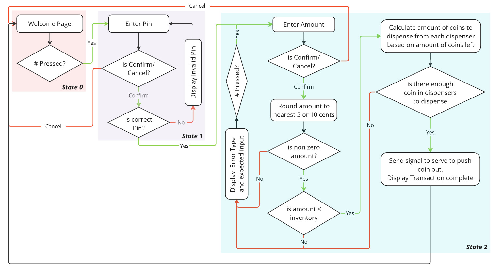
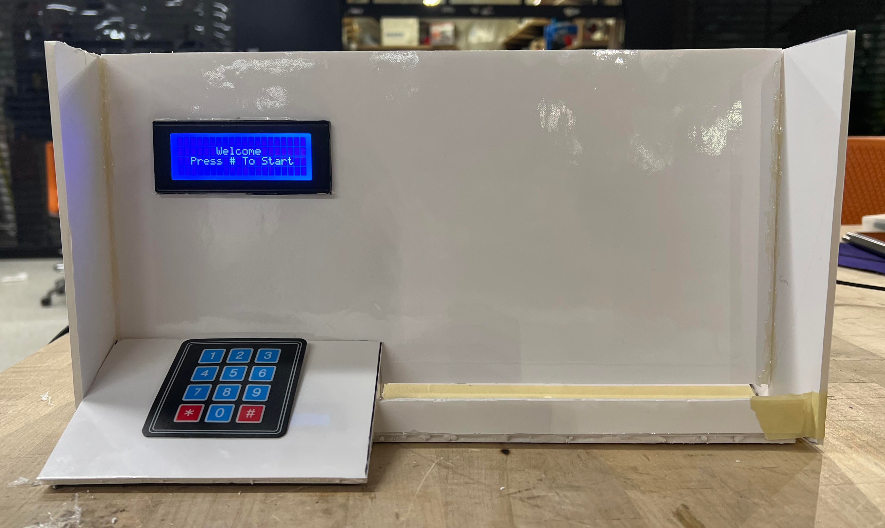

## MIE438 ATM Coin Dispenser
This repository contains the code that was used to implement a ATM Coin Dispenser using an STM32 F411RE. The main logic for the dispenser is available in ATM_Coin_Dispenser/Core/Src/main_logic.cpp

### Dispenser Logic

### Dispenser in Action

